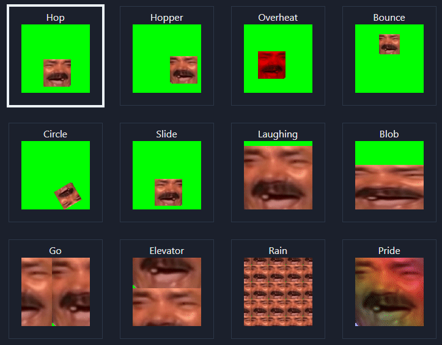

# emoteJAM-react-clone

Website 👉 https://emotejam.auto200.eu/

This is a clone of [Tsoding's emoteJAM](https://github.com/tsoding/emoteJAM). He done all the webgl work.

# Scripts

develop:
`npm run dev`

build & export:
`npm run export`
