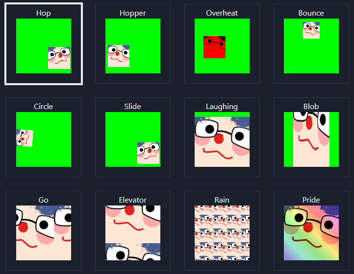

# emoteJAM-react-clone

This is a rip off of [Tsoding's emoteJAM](https://github.com/tsoding/emoteJAM). He done all the webgl work that i understand none of, kudos.

# Scripts

develop:
`npm run dev`

build & export:
`npm run export`
