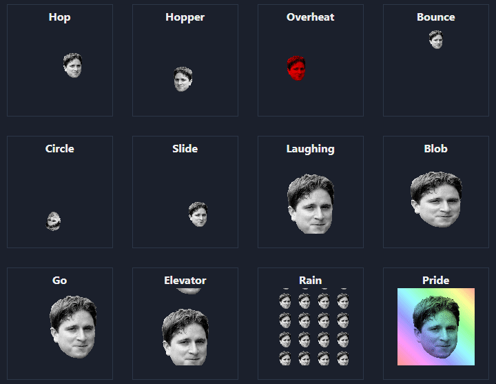

# emoteJAM-react-clone

Website 👉 https://emotejam.auto200.eu/

This is a clone of [Tsoding's emoteJAM](https://github.com/tsoding/emoteJAM).

Select an image, apply filer and download animated GIF.

# Scripts

install:
`yarn install`

develop:
`yarn dev`

build & export:
`yarn export`
